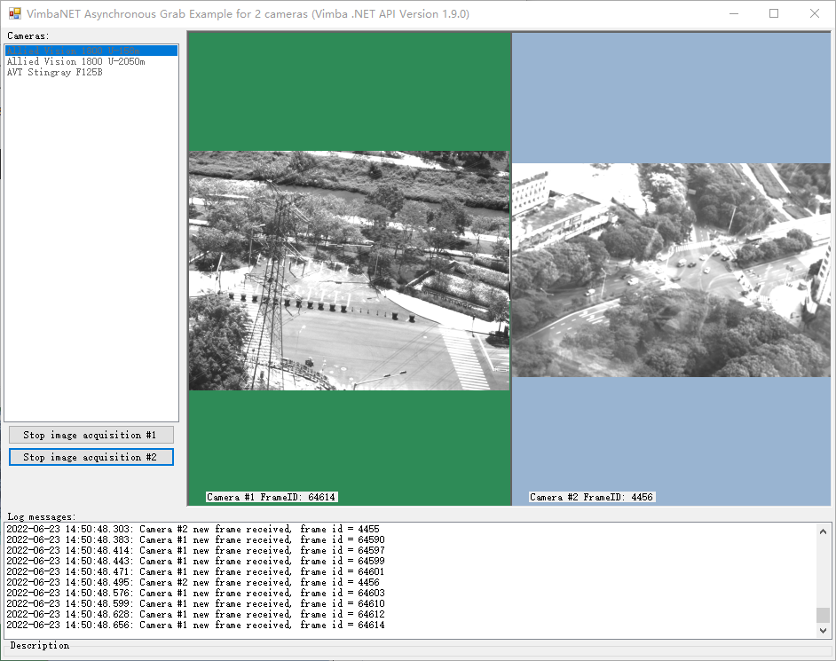

# vmbnet_async_two_cameras_viewer - 双相机自由采集C#例程
Vimba .NET C# 异步采集图像例程 - 支持两个相机同时运行 - 可以支持Free Run 自由采集模式 以及 硬件触发模式。  
Vimba .NET C# sample for two cameras based on \VimbaNET_Examples\AsynchronousGrab\Forms

## Screenshot
### 测试环境
1. 2022年6月29日08:16:24 @ Vimba 6.0
* 一台 Alvium 1800 U-1240c
* 一台 Alvium 1800 U-2050m
* 测试时长：24小时以上

2. 测试0 
* 一台 Alvium 1800 U-1240c
* 一台 Manta G895B
* 测试时长：12小时以上

 
 

## 测试
2022年6月22日20:26:36 Vimba 6.0，U158，U2050测试通过 。

